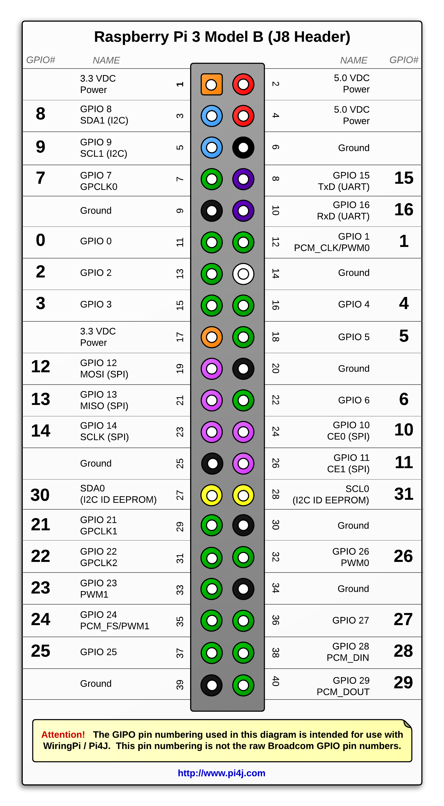

# Instructions pour la bouilloire automatique

## Table des matières

### [1. - Branchements](#1---branchements)

- [1.1 - À partir de la résistance](#11---à-partir-de-la-résistance-capteur-de-température)
- [1.2 - Sur le relais](#12---sur-le-relais)
- [1.3 - Schéma](#13---schéma)

### [2. - Lancer le serveur web](#2---lancer-le-serveur-web)

### [3. - Utiliser la bouilloire](#3---utiliser-la-bouilloire)

- [3.1 - Se connecter à l'interface web](#31---se-connecter-à-linterface-web)
- [3.2 - Utilisation de l'interface](#32---utilisation-de-linterface)

### [4. - Crédits](#4---crc3a9dits-1)

## 1. - Branchements

(voir sur le schéma pour les emplacements exacts)

### 1.1 - À partir de la résistance (capteur de température)

Fil jaune -> GPIO 4

Fil rouge -> Port 1

Fil blanc -> Port 6

### 1.2 - Sur le relais

VCC -> Port 2

IN1 -> n'importe quel port GPIO, il est choisi sur l'interface web

GND -> Port 9

### 1.3 - Schéma



---

## 2. - Lancer le serveur web

Sur le Raspberry Pi (en SSH)

Utilisateur : pi

Mot de passe : p

```sh
cd ~/autokettle/webapp
```

Mettre à jour le dépôt Github

```sh
git pull
```

Lancer le serveur web

```sh
./run.sh
```

---

## 3. - Utiliser la bouilloire

### 3.1 - Se connecter à l'interface web

IP du Raspberry:5000 ou bouilloire.nsi.lan:5000

### 3.2 - Utilisation de l'interface

Dans le menu sandwich, entrer le port GPIO utilisé pour le relais, ainsi que la température maximale de l'eau voulue

Cliquer sur 'Submit' pour valider ces informations (normalement elles sont stockées)

### 3.3 - Feu !

Cliquer sur 'Heat up' sur le menu principal pour lancer la bouilloire, elle s'arrêtera quand la température voulue sera atteinte

---

### 4. - Crédits

Bastien Croguennoc, Gwendal Troadec
